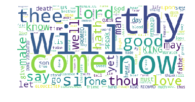

# "Fake"speare -- Machine Learning and the Voices of the Past.

## TL;DR

I used neural networks to make new Shakespeare. My network was 'trained' on a selection of Shakespeare's work and then used its training to output new, 'fake' Shakespeare which resembles the old, real Shakespeare.  

## Background

[Wikipedia](https://en.wikipedia.org/wiki/Natural_language_processing) defines Natural Language Processing (NLP) as "... a subfield of computer science, information engineering, and artificial intelligence concerned with the interactions between computers and human (natural) languages, in particular how to program computers to process and analyze large amounts of natural language data."

Or put more informally, NLP is doing computer stuff with words after you've tricked them into being math.

NLP requires that we translate text (or speech, for that matter) into the numbers that computers are able to work with and, using various sorts of algorithms and mathematical techniques, extract insights from those numbers.

This has always been a project of interest for those who would build intelligent machines, but recent years have seen both a rise in the accuracy and power of NLP and a concomitant increase in its use cases.

[Have some illustrations here of the various use cases: predictive text, Google smart answering systems, analyzing medical records, chatbots in therapy, customer service, etc]

Given how fertile the field is I decided to explore it, and chose to start by creating a neural-network text predictor which could output imitations of any text with which it was trained. This was an organic, spectacularly nonlinear process, involving many detours into the literature and various code bases throughout. But for the sake of clarity I've chosen to *present* what I learned in a nice, linear format.

I begin with a discussion of barebones 'vanilla' neural nets and climb the complexity gradient up to a deep neural net built with TensorFlow on the Amazon cloud. Along the way I'll discuss the mathematics and code which undergird this extraordinary technology.
__________________________________________________________________________________________________________

### Training Text and EDA

For whatever reason NLP engineers often train their algorithms on Shakespeare, so that's what I've used throughout the project.

One advantage of this was that it cut down on the amount of pre-processing text I had to do. When preparing text data for NLP applications it is often necessary to remove punctuation, lowercase all the words, remove HTML tags, and so on. I didn't have to do this, both because the ubiquity of Shakespeare in NLP projects meant that there was more than one pre-formatted text document available for training, and because I wanted to leave basic punctuation marks and capital letters intact for my model to learn.

A second advantage of using Shakespeare was that it enabled me to keep a consistent benchmark by which to gauge my own models to each other and to models developed elsewhere.

Though my neural net can use train on any input text, it might help to get a general overview of the Shakespeare corpus I used.

My Shakespeare.txt file is 1.1 MB, pretty small as these things go, and consists of text like this:

```
First Citizen:
Before we proceed any further, hear me speak.

All:
Speak, speak.

First Citizen:
You are all resolved rather to die than to famish?

All:
Resolved. resolved.

First Citizen:
First, you know Caius Marcius is chief enemy to the people.

All:
We know't, we know't.

First Citizen:
Let us kill him, and we'll have corn at our own price.
Is't a verdict?

All:
No more talking on't; let it be done: away, away!

Second Citizen:
One word, good citizens.

First Citizen:
We are accounted poor citizens, the patricians good.
What authority surfeits on would relieve us: if they
would yield us but the superfluity, while it were
wholesome, we might guess they relieved us humanely;
but they think we are too dear: the leanness that
afflicts us, the object of our misery, is as an
inventory to particularise their abundance; our
sufferance is a gain to them Let us revenge this with
our pikes, ere we become rakes: for the gods know I
speak this in hunger for bread, not in thirst for revenge.
```

(This is actual Shakespeare, from Act I, Scene I of "The Tragedy of Coriolanus")

I also used Latent Dirichlet Allocation (LDA) to do some basic topic modeling. Strictly speaking this wasn't necessary; though LDA is tremendously powerful and widely used in NLP, my neural net just takes raw text as input, without requiring tokenized words, a term-frequency inverse-document-frequency matrix, or LDA topics, as some nets do.

Still, this kind of procedure is helpful in getting to know the data and, if done correctly, can help calibrate intuitions about what our models *should* be doing. With this having been said, let's discuss what turned up during my explorations.



This word cloud uses the size of a word to represent its relative importance in the corpus. We can see here just how high and formal Shakespeare's classical english sounds to a modern ear, as 'thee', 'thy', and 'thou' all figure prominently (this is ironic if you know how fond The Bard was of gutter language and dirty jokes). A couple of proper nouns are visible -- "King Richard", "Gloucester", "Coriolanus", Romeo -- which give us hints as to whom the main characters are. The presence of masculine words like "lord", "sir", "king" in the absence of their feminine counterparts tell us that we're probably not about to read an enlightened paean to women's rights, which should hardly be surprising for a text published ~1605.

We can dig push this further with a remarkable technique called "Latent Dirichlet Allocation", one popular way of approaching topic modeling.

In simple terms, topic modeling uses statistical techniques to discover hidden topics in a set of documents. As humans we usually have an intuitive feel for how to classify a document -- "this is a political opinion piece"; "you'd find this in the sports section" -- but it can be surprisingly tricky to teach computers to do the same. If we *succeed*, however, our machines often prove capable of discerning very subtle relationships between documents which might not be apparent even to us.

LDA requires a matrix of frequency counts of each word across all documents. Consider the following example (adapted from [this source](https://scikit-learn.org/stable/modules/feature_extraction.html#text-feature-extraction) and a galvanize lecture):

Here is a corpus of all of our documents:

```
corpus = [
'I like to eat broccoli and bananas.',
'I ate a banana and spinach smoothie for breakfast.',
'Chinchillas and kittens are cute.',
'My sister adopted a kitten yesterday.',
'Look at this cute hamster munching on a piece of broccoli.'
]
```
with a list of the tokens (unique words) in the corpus:

```
['adopted', 'and', 'are', 'at', 'ate', 'banana', 'bananas',
'breakfast', 'broccoli', 'chinchillas', 'cute', 'eat', 'for',
'hamster', 'kitten', 'kittens', 'like', 'look', 'munching',
'my', 'of', 'on', 'piece', 'sister', 'smoothie', 'spinach',
'this', 'to', 'yesterday']
```
and a representation of how often each word appears in each document:

```
[
[0 1 0 0 0 0 1 0 1 0 0 1 0 0 0 0 1 0 0 0 0 0 0 0 0 0 0 1 0]
[0 1 0 0 1 1 0 1 0 0 0 0 1 0 0 0 0 0 0 0 0 0 0 0 1 1 0 0 0]
[0 1 1 0 0 0 0 0 0 1 1 0 0 0 0 1 0 0 0 0 0 0 0 0 0 0 0 0 0]
[1 0 0 0 0 0 0 0 0 0 0 0 0 0 1 0 0 0 0 1 0 0 0 1 0 0 0 0 1]
[0 0 0 1 0 0 0 0 1 0 1 0 0 1 0 0 0 1 1 0 1 1 1 0 0 0 1 0 0]
]
```

Look at the first row of numbers. It corresponds to document one in the corpus ('I like to eat broccoli and bananas.'),
and each number corresponds to a word in the list of tokens. The first position is for the first word in our token list ('adopted'), and since this word doesn't appear in the first corpus the count for it is 0. The second position is for 'and', which appears once in the first document and gets a count of 1.

This matrix of term frequencies is what we feed into our LDA algorithm to find latent topics. We specify in the beginning a number of topics *k* which we want the LDA to find, along with two hyper-parameters α (alpha) and β (beta).

LDA is driven by the Dirichlet Process of sampling from a distribution of distributions, and alpha and beta determine how this process unfolds. The alpha hyper-parameter drives the construction of the θ (theta, topics per document) matrix. Alpha can vary from slightly above zero to positive infinity, but in practice is usually set below 1. As alpha approaches zero each document will be made of fewer topics, and as alpha climbs each document will be made of more topics:


[Source](https://medium.com/@lettier/how-does-lda-work-ill-explain-using-emoji-108abf40fa7d)

(This is with k = 3 topics, the varying alpha value can be seen at the top of the grap)

Beta, on the other hand, does basically the same thing for our φ (phi, words per topic) matrix. Beta can vary along the same range as alpha, but it too is usually set below 1. With a smaller beta comes documents which are comprised of fewer topics, and with a larger beta comes documents which are comprised of more topics.

To summarize, LDA takes a term frequency matrix and alpha/beta hyper-parameters, and produces phi (words-per-topic) and theta (topics-per-document) matrices:


[Source](https://datawarrior.wordpress.com/2016/04/20/local-and-global-words-and-topics/)

Arriving at these matrices requires iterative updating. One way to go about this is with collapsed Gibbs sampling ([Source](https://cfss.uchicago.edu/fall2016/text02.html#latent_dirichlet_allocation)). In this approach, LDA first goes through each document and randomly assigns each of its words to one of the *k* topics chosen at the outset, which results in (terrible) initial phi and theta matrices. Then for each document d, for each word w in d, and for each topic t, LDA calculates
  - the fraction of w in d which are assigned to t (P(t|d))
  - the fraction of words in all documents which derive from word w (P(w|t)).

Topic assignment is then updated through multiplying P(t|d) * P(w|t). When this process is repeated tens of thousands of times, we eventually arrive at a pretty good estimate of topic distribution across documents and word distribution across topics. With these we can estimate which topic a document belongs to on the basis of the topics its words belong to.

Building a term frequency matrix for my Shakespeare corpus and running it through an LDA with k = 3 results in the following topics:

```
Topic 0:
thou thy thee father love did lady hath art st

Topic 1:
king lord duke vincentio richard edward henry york shall brother

Topic 2:
sir good come shall ll petruchio say tis tell ay
```
Interestingly, topic modeling does not always produce concepts which map cleanly on to concepts which are comprehensible to humans. This could be because there are ultrafine statistical nuances to the corpus, because there isn't a big enough corpus to clearly elucidate topics, or because there weren't enough iterations performed.

In the above, topic 0 includes 2nd person pronouns ('thou', 'thee'), as well as 'father' and 'lady'. I can imagine that this might be something like the concept of 'person', though that wouldn't explain what art is doing there.

Topic 1 looks a little more concrete, with some proper royal titles and a couple of names we might expect to be associated with those titles.

The only thing I can say about topic 2 is that 'say' and 'tell' are related, otherwise it's a bit of a mess.

We can do this again with k = 10:

```
Topic 0:
thou thy art st er hast blood men father queen

Topic 1:
life york doth death think die nurse gone thing words

Topic 2:
duke king vincentio richard brother nay queen iii mean pardon

Topic 3:
sir good love romeo sweet comes man provost madam second

Topic 4:
time night like shall look camillo peace news tongue katharina

Topic 5:
lord king edward father son day honour warwick god prince

Topic 6:
shall ll tell come know make tis hear say speak

Topic 7:
hath say shall master heaven did way stay stand till

Topic 8:
thee thy away lucio friar word isabella bring mistress fair

Topic 9:
come lady let ay good pray henry petruchio live leave
```

Subjectively this does seem a little better. Topic 0 now has 'men' and 'father', and topic 6 has managed to pick up 'hear' and 'speak' along with 'say' and 'tell'.
__________________________________________________________________________________________________________

## Neural Networks

There are a number of ways to go about the business of NLP. This project was inspired by Jamie Brew's ["Harry Potter and the Portrait of What Looked Like a Large Pile of Ash"](https://botnik.org/content/harry-potter.html), which utilizes a Markov-Chain to make word-by-word predictions.

But from what I could tell the industry standard seems to be neural nets (NNs). This together with the fact that there are plenty of NN-based NLP projects from which to learn convinced me to take this particular path into the field.

### A Basic Neural Network

For all their scope, power, flexibility, and hyped-up press NNs can be understood at a high level with relatively few concepts. The simplest NNs have an input layer, a hidden layer or two, and an output layer


[Source](https://www.youtube.com/watch?v=aircAruvnKk)

In this image the leftmost layer is the input layer, the two middle layers are hidden layers, and the rightmost layer is the output layer.

Naturally enough our inputs are fed into the input layer. These could be numbers representing pixel densities, numbers representing sound frequencies, or numbers representing unique words in a corpus of text, but they *must* be numbers, and they are usually in either a vector or matrix.

 You can see that each of the input nodes is connected to one or more of the nodes in the hidden layer, and so on for each set of layer-to-layer connections until the output layer. Let's call these connections 'edges'. Each edge has a weight -- some number like 1.2 or .65 -- associated with it.

When a vector of numbers passes through the input layer, the entire vector is multiplied by the weight of the edges between the nodes in the input layer and the nodes to which they are connected in the hidden layer. If a given input node is connected to multiple hidden-layer nodes, then this procedure occurs for each of the edges, which may have the same weights or different weights.

The input 'forward' propagates in this fashion until the NN outputs a prediction from its final layer:


[Source](https://www.youtube.com/watch?v=aircAruvnKk&feature=youtu.be)

(The images in this section are of an NN which is learning to identify handwritten digits, but the basic principles don't change much when we are processing text input, as I did in my project)

 This prediction is then compared against a test value, which tells the NN how well or poorly it did. Since the weights within an NN are often initialized randomly the predictions start out pretty bad. But after each attempt the NN can use the information about how good its prediction was to 'back' propagate weight adjustments:

[Get a gif of this happening]

Backpropagation is just the recursive application of the Chain Rule from calculus to the weights in an NN. Incredibly, the equations work such that the weights which contributed most to a bad prediction are updated the most.

This forward propagation -> prediction -> back propagation cycle continues for a while (sometimes days), and then the NN is considered 'trained'. There are a near-infinite number of ways to build, train, and work with NNs, but they will almost always share this basic structure.

Of course there are many, many variants on the standard NN. My project began with a recurrent neural network (RNN), not a vanilla NN. A recurrent neural network (RNN) is one that is able to reach further back in a stream of data to learn relationships between variables than a standard NN. If you're predicting stock prices an NN might be able to use a day's or a week's worth of data to predict tomorrow's prices, but the further back it looks the worse it will do because its architecture just can't handle more depth; RNNs, on the other hand, are well suited to precisely this kind of task.

### Using an RNN for text prediction

With all of this context in place I can now discuss the specifics of my own NLP project. What I did was use various tools to build a few different RNNs to *generate text* character-by-character.

Every book, essay, and document contains a unique distribution of characters, which depends upon the author's intended audience, style, word choices, etc. The likelihood of the character 'r' following the character 'o' will depend, for example, on whether or not you're using American or British spellings for words like honor (v.s. honour) and color (v.s. colour).

When I train an RNN on a corpus, it's learning this distribution so that I can later use it to output new text with approximately the same distribution.

But the model is not using a single character to output the next, it's using a sequence of characters. Consider the following sentence:

'The boy is wearing a green coat.'

When predicting the 's' in 'is' I could look at:

- 'i'     (the previous letter), or
- ' i'    (two characters back, counting the space), or
- 'y i'   (three characters back, again counting space), or
- 'oy i'  (four characters back), or
- 'boy i' (five characters back)

And so on. When I specify my model's architecture I tell it how many characters to look at to predict what the next character will be. Determining the optimum length for prediction is non-trivial; since I put this project together from papers, Youtube talks, and blog posts I tended to use whatever sequence length the author recommended.

There are a number of excellent resources for implementing a simple RNN, the one I used was [Andrej Karpathy's](https://gist.github.com/karpathy/d4dee566867f8291f086) vanilla RNN implementation in python, which gave me a much better feel for how the initialization, forward propagation, and back propagation worked.


### Torch, TensorFlow, and Migrating to the Cloud

<Include a table with cloud/no cloud/ tf v.s. torch, breakdown of lua v.s. keras etc, what my sequence length was, etc.>
<Make my final comparisons between Shakespeare outputs in this section>

The first RNN I built was described in the last paragraph, but the model was I actually trained and used was based on Justin Johnson's [torch-rnn](https://github.com/jcjohnson/torch-rnn) implementation, a multi-layer RNN with both long Short Term Memory (LSTM) and gated recurrent units (GRU).


### Interpreting Results

Discuss perplexity and loss, but also subjective evaluation.

### Future work

- RNNs are hard to train, but exciting new work on [Hessian-Free optimizers](http://www.cs.utoronto.ca/~ilya/pubs/2011/LANG-RNN.pdf) might remove some of the headache. I'd like to explore this option.
